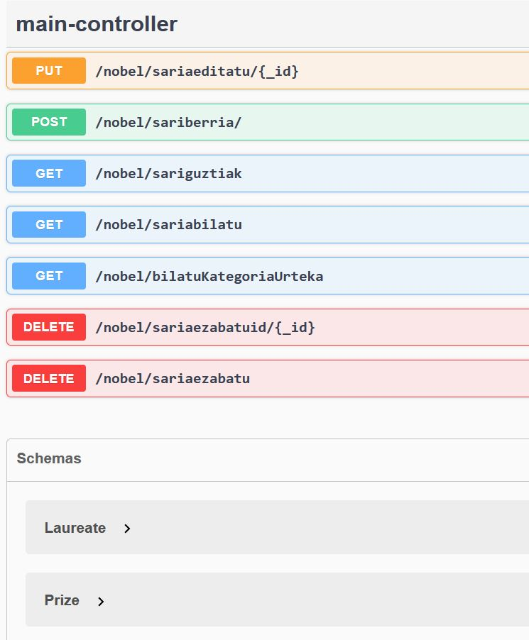
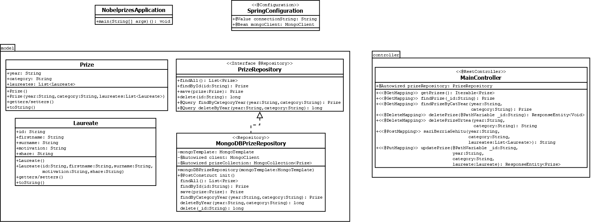

# NobelPrizesMongoRestApi by Julen Herrero

This project has been developed for the Data Access subject of the second course of Development of Multiplatform Applications in Uni Eibar. The main task is to develop a Rest Api that access a MongoDB database and to learn how a Rest Api can fit in a web application. In this case a JSON dataset was selected and loaded in a MongoDB database. That dataset collects all the nobel prizes that were given in the last century. These are the general use steps to take into account:

- Swagger access: http://localhost:8081/swagger-ui/index.html
- MongoDB connection String: mongodb://localhost
- Database name: nobelprize
- Collection name: prizes
- Maven execution command (same directory as pom.xml): mvn spring-boot:run

## Dataset 
The dataset has a particular structure, each prize is a JSONObject but at the same time this prizes have three main attributes; two Strings and an JSONObject Array. The main idea was to deal with a certain level of depth in our datasets avoiding picking plain datasets. The dataset selected for the project was picked from a collection of datasets located in GitHub. 

This is the link: https://github.com/jdorfman/awesome-json-datasets?tab=readme-ov-file

As mentioned before the dataset was originally taken as a JSON document. Before the dataset was imported to a MongoDB database it suffered a small change on the structure. The Nobel Prizes were inside an array, having this structure and importing to MongoDB we got as a result a single document inside our collection. Inside that array they were 670 prizes but importing in this way makes no sense, so the array was deleted and in that way Mongo could import each prize as a single document. Before starting making the import is compulsory to create a new connnection to our MongoDB server. In this case we configured a connection to the localhost using this connection string: mongodb://localhost.

## Rest Service

The Rest service has a particular structure. Using this service the user can make different types of request, those types are the same that a CRUD app makes; create(POST), read(GET), update(PUT) and delete(DELETE). Each endpoint manages a different type of request, thats why depending which one is going to be executed the service will do one type of operation or another. The request can be made using the Swagger user interface or another development environment as Imsomnia, Postman etc. From Swagger you can access the different endpoints, see the model schemas and get the api doc in yaml format. This is an overview:

|Type|Endpoint|Result|
|----|--------|------|
|GET |/nobel/sariguztiak| This returns all the Prizes in JSON format|
|GET |/nobel/sariabilatu| This returns the Prize that matches the passed parameter|
|GET |/nobel/bilatuKategoriaUrteka|This returns the Prize that matches the passed parameters|
|POST |/nobel/sariberria|"Nobel Saria era egokian gehitu da"|
|PUT |/nobel/sariaeditatu/{_id}|Response headers and response (ResponseEntity HttpRequestCode):  connection: keep-alive content-length: 0 date: Wed,10 Jan 2024 15:20:58 GMT keep-alive: timeout=60 CODE: 200 Description: OK|
|DELETE |/nobel/sariaezabatuid/{_id}|RESPONSE OF THE HTTPREQUEST STATUS CODE:  connection: keep-alive content-length: 0 date: Wed,10 Jan 2024 15:17:58 GMT keep-alive: timeout=60 CODE: 200 Description: OK  FROM TERMINAL:  Successful case: "Nobel Saria ezabatua izan da, ezabatutako kopurua: 1" Failure case: "Errore bat gertatu da Nobel Saria ezabatzen, saiatu berriro mesedez..."|
|DELETE |/nobel/sariaezabatu|Successful case: "Nobel Saria era egokian ezabatu da" Failure case: "Errore bat gertatu da Nobel Saria ezabatzen, saiatu berriro mesedez..."|

## MongoDB

This SpringBoot application is a service that creates request for a MongoDB database. For creating the database is neccesary to install the Community edition of MongoDB and MongoDB Compass that is a MongoDB client. Once installed we open the client and we create a connection to our local machine. Here you can create remote connection to a servers, to the local machine and even to the MongoDB cluster or the Cloud. 

Editing and adjusting that connection string will give you the possibility to be able to connect where you need. In this case the application is configured to connect to the local machine via Localhost. Entering mongodb://localhost you can connect and proceed to create the database. 

In the left side you can see the databases, there you create the database and the collection where the data is going to be kept. The name of the database is called nobelprize and the collection is called prizes. Once the database and the collection are created we import our dataset. The dataset is a JSON document, just importing the document mongo will create a large amount of documents. Each document is a nobel prizes and each prize has its own attributes:

- Year (String): The year where the prize was given
- Category (String): The category of the prize
- Laureates (List<Laureate> of laureates): List of the people that won the prize
- Each Laureate has:
  1. id (String): Identificator of the winner
  2. firstname (String): The first name of the winner
  3. surname (String): The surname of the winner
  4. motivation (String): The contribution or the reason why he won the prize
  5. share (String): With how many people shared the prize

## Java Project

The Java Project has been developed creating a SpringBoot project. We are using also a Maven type of project because we can add comfortably dependencies and include them in our project, this is made using the pom.xml document inside the project. Inside the pom we can find the build in, plugins and dependencies of our project. Is a effective and comfortable way to add different type of resources to our project.

The SpringBoot type of projects have a particular structure of classes and models. The project is divided in two main packages; model and controller. Outside those packages we have two classes more. The first class is the SpringConfiguration. With this class the aplication can get the connection string from the application properties and get the MongoDB client creating at the same time the conversion from BSONDocument to JavaObject. And the second class is the Application main class. With this class the aplication gets started and runs the whole service.

Inside the model package we can find different type of classes. The object models are one of those, with these models the application creates a mapping to structure the data and be able to process them in MongoDB. As we are working with a type of object where the object itself has an object inside we have to map also the subobject. In this case we have a Prize class and inside that Prize class we have as an attribute a List that contains a Laureate class objects. For that purpose the Laureate class has been developed also having its own atributes. Once these models are build the conversion from the JavaObjects and the Mongo documents can be made. Executing Swagger and scrolling down to the bottom we can see the schemas. 

Lefting the objects classes apart, we have two classes more that are the repositories. In those repositories we can collect the data and then manage them to execute operations. We have a interface where we declare the basic functions and then we have a MongoDB repository. This repository implements the functions declared in the repository interface. Thos functions are the basic operation that later the controller will use to create different type of requests.

Finally, inside the controller package we have a single class. This class is the main controller where we create the different endpoints of the service and the main request mapping. This is the class diagram of the application:

